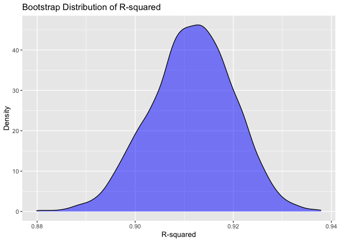
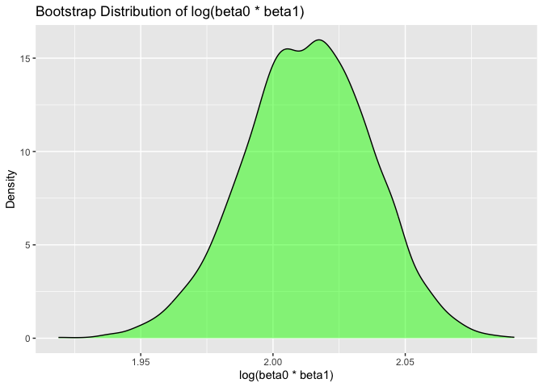

Homework 6
================
Mia Isaacs
2024-12-01

### load libraries

``` r
library(tidyverse)
```

    ## ── Attaching core tidyverse packages ──────────────────────── tidyverse 2.0.0 ──
    ## ✔ dplyr     1.1.4     ✔ readr     2.1.5
    ## ✔ forcats   1.0.0     ✔ stringr   1.5.1
    ## ✔ ggplot2   3.5.1     ✔ tibble    3.2.1
    ## ✔ lubridate 1.9.3     ✔ tidyr     1.3.1
    ## ✔ purrr     1.0.2     
    ## ── Conflicts ────────────────────────────────────────── tidyverse_conflicts() ──
    ## ✖ dplyr::filter() masks stats::filter()
    ## ✖ dplyr::lag()    masks stats::lag()
    ## ℹ Use the conflicted package (<http://conflicted.r-lib.org/>) to force all conflicts to become errors

``` r
library(modelr)
library(rnoaa)
```

    ## The rnoaa package will soon be retired and archived because the underlying APIs have changed dramatically. The package currently works but does not pull the most recent data in all cases. A noaaWeather package is planned as a replacement but the functions will not be interchangeable.

``` r
set.seed(123)
```

## Problem 1

### load and clean data

``` r
weather_df = 
  rnoaa::meteo_pull_monitors(
    c("USW00094728"),
    var = c("PRCP", "TMIN", "TMAX"), 
    date_min = "2017-01-01",
    date_max = "2017-12-31") %>%
  mutate(
    name = recode(id, USW00094728 = "CentralPark_NY"),
    tmin = tmin / 10,
    tmax = tmax / 10) %>%
  select(name, id, everything())
```

    ## using cached file: /Users/miaisaacs/Library/Caches/org.R-project.R/R/rnoaa/noaa_ghcnd/USW00094728.dly

    ## date created (size, mb): 2024-09-26 09:04:42.987907 (8.651)

    ## file min/max dates: 1869-01-01 / 2024-09-30

### draw bootstrap sample

``` r
boot_sample = function(df) {
  sample_frac(df, replace = TRUE)
}
```

### generate 5000 samples

``` r
boot_results = 
  tibble(
    strap_id = 1:5000
  ) |> 
  mutate(
    strap_sample = map(strap_id, ~ boot_sample(weather_df)),
    models = map(strap_sample, ~ lm(tmax ~ tmin, data = .x)),
    model_summaries = map(models, broom::glance),
    coefficients = map(models, broom::tidy)
  ) |> 
  unnest(model_summaries, names_sep = "_summary") |> 
  unnest(coefficients, names_sep = "_coef") |> 
  janitor::clean_names() |> 
  rename_with(
    ~ gsub("^model_summaries_", "", .), 
    starts_with("model_summaries_")    
  )
```

### produce estimates

``` r
bootstrap_estimates = 
  boot_results |> 
  group_by(strap_id) |> 
  summarize(
    r_squared = unique(summaryr_squared),  
    log_beta0_beta1 = log(prod(coefficients_coefestimate))
  )
```

### plot distributions

``` r
# R-squared distribution
bootstrap_estimates |> 
  ggplot(aes(x = r_squared)) +
  geom_density(fill = "blue", alpha = 0.5) +
  labs(
    title = "Bootstrap Distribution of R-squared",
    x = "R-squared",
    y = "Density"
  )
```

<!-- -->

``` r
# log(beta0 * beta1) distribution
bootstrap_estimates |> 
  ggplot(aes(x = log_beta0_beta1)) +
  geom_density(fill = "green", alpha = 0.5) +
  labs(
    title = "Bootstrap Distribution of log(beta0 * beta1)",
    x = "log(beta0 * beta1)",
    y = "Density"
  )
```

<!-- -->

The distributions of r-squared and log(beta0\*beta1) in our sample both
appear to be approximately normal.

### compute confidence intervals

``` r
ci_results = 
  bootstrap_estimates |> 
  reframe(
    r2_ci_lower = quantile(r_squared, 0.025),
    r2_ci_upper = quantile(r_squared, 0.975),
    log_beta_ci_lower = quantile(log_beta0_beta1, 0.025),
    log_beta_ci_upper = quantile(log_beta0_beta1, 0.975)
  )
```
