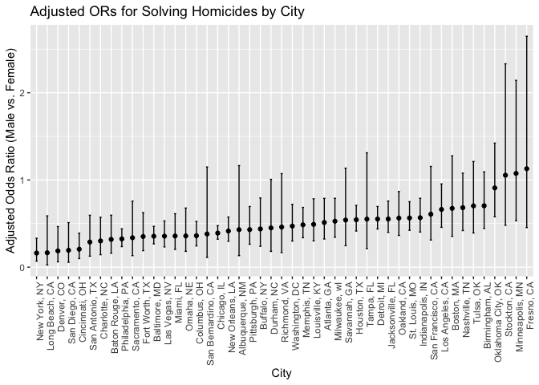
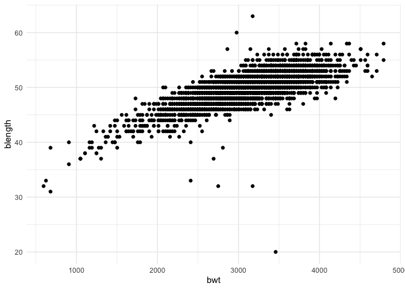
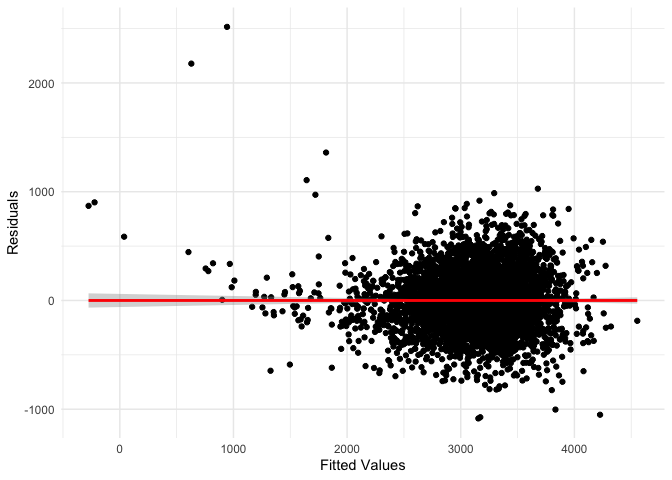
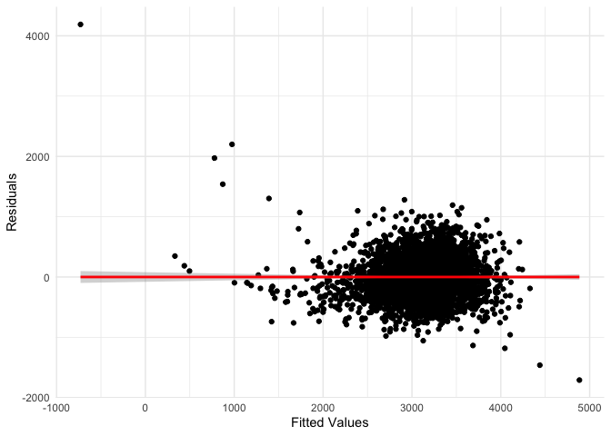
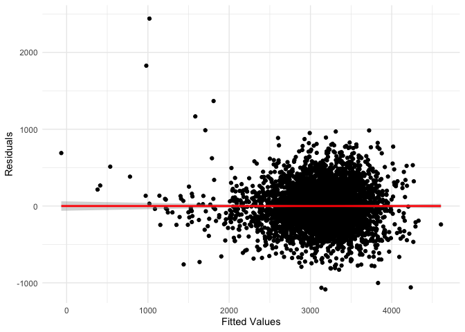
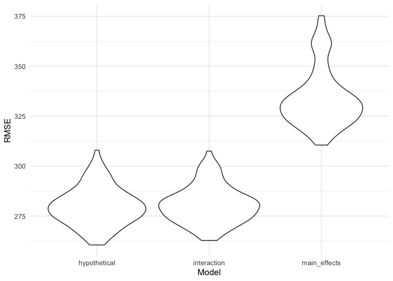

Homework 6
================
Mia Isaacs
2024-12-01

### load libraries

``` r
library(tidyverse)
```

    ## ── Attaching core tidyverse packages ──────────────────────── tidyverse 2.0.0 ──
    ## ✔ dplyr     1.1.4     ✔ readr     2.1.5
    ## ✔ forcats   1.0.0     ✔ stringr   1.5.1
    ## ✔ ggplot2   3.5.1     ✔ tibble    3.2.1
    ## ✔ lubridate 1.9.3     ✔ tidyr     1.3.1
    ## ✔ purrr     1.0.2     
    ## ── Conflicts ────────────────────────────────────────── tidyverse_conflicts() ──
    ## ✖ dplyr::filter() masks stats::filter()
    ## ✖ dplyr::lag()    masks stats::lag()
    ## ℹ Use the conflicted package (<http://conflicted.r-lib.org/>) to force all conflicts to become errors

``` r
library(modelr)
library(rnoaa)
```

    ## The rnoaa package will soon be retired and archived because the underlying APIs have changed dramatically. The package currently works but does not pull the most recent data in all cases. A noaaWeather package is planned as a replacement but the functions will not be interchangeable.

``` r
set.seed(123)
```

## Problem 1

### load and clean data

``` r
weather_df = 
  rnoaa::meteo_pull_monitors(
    c("USW00094728"),
    var = c("PRCP", "TMIN", "TMAX"), 
    date_min = "2017-01-01",
    date_max = "2017-12-31") %>%
  mutate(
    name = recode(id, USW00094728 = "CentralPark_NY"),
    tmin = tmin / 10,
    tmax = tmax / 10) %>%
  select(name, id, everything())
```

    ## using cached file: /Users/miaisaacs/Library/Caches/org.R-project.R/R/rnoaa/noaa_ghcnd/USW00094728.dly

    ## date created (size, mb): 2024-09-26 09:04:42.987907 (8.651)

    ## file min/max dates: 1869-01-01 / 2024-09-30

### draw bootstrap sample

``` r
boot_sample = function(df) {
  sample_frac(df, replace = TRUE)
}
```

### generate 5000 samples

``` r
boot_results = 
  tibble(
    strap_id = 1:5000
  ) |> 
  mutate(
    strap_sample = map(strap_id, ~ boot_sample(weather_df)),
    models = map(strap_sample, ~ lm(tmax ~ tmin, data = .x)),
    model_summaries = map(models, broom::glance),
    coefficients = map(models, broom::tidy)
  ) |> 
  unnest(model_summaries, names_sep = "_summary") |> 
  unnest(coefficients, names_sep = "_coef") |> 
  janitor::clean_names() |> 
  rename_with(
    ~ gsub("^model_summaries_", "", .), 
    starts_with("model_summaries_")    
  )
```

### produce estimates

``` r
bootstrap_estimates = 
  boot_results |> 
  group_by(strap_id) |> 
  summarize(
    r_squared = unique(summaryr_squared),  
    log_beta0_beta1 = log(prod(coefficients_coefestimate))
  )
```

### plot distributions

``` r
# R-squared distribution
bootstrap_estimates |> 
  ggplot(aes(x = r_squared)) +
  geom_density(fill = "blue", alpha = 0.5) +
  labs(
    title = "Bootstrap Distribution of R-squared",
    x = "R-squared",
    y = "Density"
  )
```

<!-- -->

``` r
# log(beta0 * beta1) distribution
bootstrap_estimates |> 
  ggplot(aes(x = log_beta0_beta1)) +
  geom_density(fill = "green", alpha = 0.5) +
  labs(
    title = "Bootstrap Distribution of log(beta0 * beta1)",
    x = "log(beta0 * beta1)",
    y = "Density"
  )
```

<!-- -->

The distributions of r-squared and log(beta0\*beta1) in our sample both
appear to be approximately normal.

### compute confidence intervals

``` r
ci_results = 
  bootstrap_estimates |> 
  reframe(
    r2_ci_lower = quantile(r_squared, 0.025),
    r2_ci_upper = quantile(r_squared, 0.975),
    log_beta_ci_lower = quantile(log_beta0_beta1, 0.025),
    log_beta_ci_upper = quantile(log_beta0_beta1, 0.975)
  )
```

## Problem 2

### load and clean data

``` r
homicide_data = read_csv("data/homicide-data.csv") |> 
  mutate(
    city_state = paste(city, state, sep = ", "),
    solved = ifelse(disposition %in% c("Closed by arrest", "Closed without arrest"), 1, 0),
    victim_age = as.numeric(victim_age)
  ) |> 
  filter(
    !(city_state %in% c("Dallas, TX", "Phoenix, AZ", "Kansas City, MO", "Tulsa, AL")),
    victim_race %in% c("White", "Black"),
    !is.na(victim_age)
  )
```

    ## Rows: 52179 Columns: 12
    ## ── Column specification ────────────────────────────────────────────────────────
    ## Delimiter: ","
    ## chr (9): uid, victim_last, victim_first, victim_race, victim_age, victim_sex...
    ## dbl (3): reported_date, lat, lon
    ## 
    ## ℹ Use `spec()` to retrieve the full column specification for this data.
    ## ℹ Specify the column types or set `show_col_types = FALSE` to quiet this message.

    ## Warning: There was 1 warning in `mutate()`.
    ## ℹ In argument: `victim_age = as.numeric(victim_age)`.
    ## Caused by warning:
    ## ! NAs introduced by coercion

### logistic regression for Baltimore

``` r
baltimore_data <- homicide_data |> 
  filter(city_state == "Baltimore, MD")

baltimore_fit <- glm(
  solved ~ victim_age + victim_sex + victim_race,
  data = baltimore_data,
  family = binomial
)
```

### obtain OR for male vs. female

``` r
baltimore_results <- baltimore_fit |> 
  broom::tidy(conf.int = TRUE, exponentiate = TRUE) |> 
  filter(term == "victim_sexMale")

baltimore_results
```

    ## # A tibble: 1 × 7
    ##   term           estimate std.error statistic  p.value conf.low conf.high
    ##   <chr>             <dbl>     <dbl>     <dbl>    <dbl>    <dbl>     <dbl>
    ## 1 victim_sexMale    0.355     0.143     -7.26 3.74e-13    0.267     0.468

### logistic regression for all cities

``` r
city_fit_results <- homicide_data |> 
  group_by(city_state) |> 
  nest() |> 
  mutate(
    model = map(data, ~ glm(
      solved ~ victim_age + victim_sex + victim_race,
      data = .x,
      family = binomial
    )),
    results = map(model, ~ broom::tidy(.x, conf.int = TRUE, exponentiate = TRUE))
  ) |> 
  select(city_state, results) |> 
  unnest(results) |> 
  filter(term == "victim_sexMale") |> 
  arrange(estimate)
```

    ## Warning: There were 44 warnings in `mutate()`.
    ## The first warning was:
    ## ℹ In argument: `results = map(model, ~broom::tidy(.x, conf.int = TRUE,
    ##   exponentiate = TRUE))`.
    ## ℹ In group 1: `city_state = "Albuquerque, NM"`.
    ## Caused by warning:
    ## ! glm.fit: fitted probabilities numerically 0 or 1 occurred
    ## ℹ Run `dplyr::last_dplyr_warnings()` to see the 43 remaining warnings.

``` r
city_fit_results
```

    ## # A tibble: 47 × 8
    ## # Groups:   city_state [47]
    ##    city_state     term  estimate std.error statistic  p.value conf.low conf.high
    ##    <chr>          <chr>    <dbl>     <dbl>     <dbl>    <dbl>    <dbl>     <dbl>
    ##  1 New York, NY   vict…    0.161     0.395     -4.62 3.81e- 6   0.0691     0.331
    ##  2 Long Beach, CA vict…    0.165     0.757     -2.38 1.73e- 2   0.0258     0.588
    ##  3 Denver, CO     vict…    0.187     0.507     -3.31 9.34e- 4   0.0613     0.466
    ##  4 San Diego, CA  vict…    0.194     0.550     -2.99 2.83e- 3   0.0560     0.511
    ##  5 Cincinnati, OH vict…    0.206     0.350     -4.53 5.98e- 6   0.0977     0.390
    ##  6 San Antonio, … vict…    0.288     0.393     -3.17 1.52e- 3   0.126      0.595
    ##  7 Charlotte, NC  vict…    0.301     0.351     -3.42 6.16e- 4   0.143      0.572
    ##  8 Baton Rouge, … vict…    0.319     0.333     -3.44 5.87e- 4   0.160      0.596
    ##  9 Philadelphia,… vict…    0.324     0.159     -7.07 1.50e-12   0.235      0.440
    ## 10 Sacramento, CA vict…    0.337     0.440     -2.47 1.35e- 2   0.132      0.757
    ## # ℹ 37 more rows

### plot with ORs and CIs for each city

``` r
city_fit_results |> 
  ggplot(aes(x = reorder(city_state, estimate), y = estimate)) +
  geom_point() +
  geom_errorbar(aes(ymin = conf.low, ymax = conf.high), width = 0.2) +
  labs(
    title = "Adjusted ORs for Solving Homicides by City",
    x = "City",
    y = "Adjusted Odds Ratio (Male vs. Female)"
  ) +
  theme(axis.text.x = element_text(angle = 90, hjust = 1))
```

<!-- -->

For most cities, the adjusted OR for solving homicides comparing males
to females is below 1, indicating that male homicide victims are less
likely to have their attacker arrested. The odds of having a closed
homicide case for males are \<1 times the odds of having a closed
homicide case for females for all cities in this dataset except
Stockton, CA, Minneapolis, MN, and Fresno, CA.

## Problem 3

### load and clean data

``` r
birthweight_df = read_csv("data/birthweight.csv") |> 
  mutate(babysex = as.factor(babysex),
         frace = as.factor(frace),
         malform = as.factor(malform),
         mrace = as.factor(mrace)
         )
```

    ## Rows: 4342 Columns: 20
    ## ── Column specification ────────────────────────────────────────────────────────
    ## Delimiter: ","
    ## dbl (20): babysex, bhead, blength, bwt, delwt, fincome, frace, gaweeks, malf...
    ## 
    ## ℹ Use `spec()` to retrieve the full column specification for this data.
    ## ℹ Specify the column types or set `show_col_types = FALSE` to quiet this message.

``` r
summary(birthweight_df)
```

    ##  babysex      bhead          blength           bwt           delwt      
    ##  1:2230   Min.   :21.00   Min.   :20.00   Min.   : 595   Min.   : 86.0  
    ##  2:2112   1st Qu.:33.00   1st Qu.:48.00   1st Qu.:2807   1st Qu.:131.0  
    ##           Median :34.00   Median :50.00   Median :3132   Median :143.0  
    ##           Mean   :33.65   Mean   :49.75   Mean   :3114   Mean   :145.6  
    ##           3rd Qu.:35.00   3rd Qu.:51.00   3rd Qu.:3459   3rd Qu.:157.0  
    ##           Max.   :41.00   Max.   :63.00   Max.   :4791   Max.   :334.0  
    ##     fincome      frace       gaweeks      malform     menarche    
    ##  Min.   : 0.00   1:2123   Min.   :17.70   0:4327   Min.   : 0.00  
    ##  1st Qu.:25.00   2:1911   1st Qu.:38.30   1:  15   1st Qu.:12.00  
    ##  Median :35.00   3:  46   Median :39.90            Median :12.00  
    ##  Mean   :44.11   4: 248   Mean   :39.43            Mean   :12.51  
    ##  3rd Qu.:65.00   8:  14   3rd Qu.:41.10            3rd Qu.:13.00  
    ##  Max.   :96.00            Max.   :51.30            Max.   :19.00  
    ##     mheight          momage     mrace        parity            pnumlbw 
    ##  Min.   :48.00   Min.   :12.0   1:2147   Min.   :0.000000   Min.   :0  
    ##  1st Qu.:62.00   1st Qu.:18.0   2:1909   1st Qu.:0.000000   1st Qu.:0  
    ##  Median :63.00   Median :20.0   3:  43   Median :0.000000   Median :0  
    ##  Mean   :63.49   Mean   :20.3   4: 243   Mean   :0.002303   Mean   :0  
    ##  3rd Qu.:65.00   3rd Qu.:22.0            3rd Qu.:0.000000   3rd Qu.:0  
    ##  Max.   :77.00   Max.   :44.0            Max.   :6.000000   Max.   :0  
    ##     pnumsga      ppbmi            ppwt           smoken           wtgain      
    ##  Min.   :0   Min.   :13.07   Min.   : 70.0   Min.   : 0.000   Min.   :-46.00  
    ##  1st Qu.:0   1st Qu.:19.53   1st Qu.:110.0   1st Qu.: 0.000   1st Qu.: 15.00  
    ##  Median :0   Median :21.03   Median :120.0   Median : 0.000   Median : 22.00  
    ##  Mean   :0   Mean   :21.57   Mean   :123.5   Mean   : 4.145   Mean   : 22.08  
    ##  3rd Qu.:0   3rd Qu.:22.91   3rd Qu.:134.0   3rd Qu.: 5.000   3rd Qu.: 28.00  
    ##  Max.   :0   Max.   :46.10   Max.   :287.0   Max.   :60.000   Max.   : 89.00

### look at data

``` r
ggplot(birthweight_df, aes(x = bwt, y = blength)) + 
  geom_point() + 
  theme_minimal()
```

<!-- -->

### propose model

``` r
hypothetical_model <- lm(bwt ~ blength + bhead + babysex + gaweeks + delwt + fincome + 
                            smoken + wtgain + momage + mheight + parity, data = birthweight_df)

birthweight_df |> 
  add_predictions(hypothetical_model) |>
  add_residuals(hypothetical_model) |>
  ggplot(aes(x = pred, y = resid)) + 
  geom_point() + 
  geom_smooth(method = "lm", color = "red") + 
  theme_minimal() +
  labs(x = "Fitted Values", y = "Residuals")
```

    ## `geom_smooth()` using formula = 'y ~ x'

<!-- -->

My modeling process was based on hypothesized factors that may influence
infant birthweight. Of the predictors in this dataset, I felt that baby
length, head circumference, sex, gestational age, and mother’s weight at
delivery, income, smoking status, age, height, and prior live births
would be most likely to explain differences in birthweight. Some
predictors, such as malform and pnumgsa, had most observations coded as
0 and would thus likely have little impact in our model. I only wanted
to include the most significant predictors to ensure parsimony.

### fit model with main effects

``` r
main_effects_model <- lm(bwt ~ blength + gaweeks, data = birthweight_df)

birthweight_df |>
  add_predictions(main_effects_model) |>
  add_residuals(main_effects_model) |>
  ggplot(aes(x = pred, y = resid)) + 
  geom_point() + 
  geom_smooth(method = "lm", color = "red") + 
  theme_minimal() +
  labs(x = "Fitted Values", y = "Residuals")
```

    ## `geom_smooth()` using formula = 'y ~ x'

<!-- -->

### fit model with interactions

``` r
interaction_model <- lm(bwt ~ bhead * blength * babysex + gaweeks + delwt + smoken + 
                          wtgain + momage + mheight, data = birthweight_df)

birthweight_df |>
  add_predictions(interaction_model) |>
  add_residuals(interaction_model) |>
  ggplot(aes(x = pred, y = resid)) + 
  geom_point() + 
  geom_smooth(method = "lm", color = "red") + 
  theme_minimal() +
  labs(x = "Fitted Values", y = "Residuals")
```

    ## `geom_smooth()` using formula = 'y ~ x'

<!-- -->

### make comparisons

``` r
cv_df <- crossv_mc(birthweight_df, 100) |> 
  mutate(
    train = map(train, as_tibble),
    test = map(test, as_tibble)
  )

cv_res_df <- cv_df |> 
  mutate(
    hypothetical_model = map(train, \(x) lm(bwt ~ blength + bhead + gaweeks + delwt + fincome + 
                                              smoken + wtgain + momage + mheight + parity, data = x)),
    main_effects_model = map(train, \(x) lm(bwt ~ blength + gaweeks, data = x)),
    interaction_model = map(train, \(x) lm(bwt ~ bhead * blength * babysex + gaweeks + delwt + smoken + 
                                             wtgain + momage + mheight, data = x))
  ) |> 
  mutate(
    rmse_hypothetical = map2_dbl(hypothetical_model, test, rmse),
    rmse_main_effects = map2_dbl(main_effects_model, test, rmse),
    rmse_interaction = map2_dbl(interaction_model, test, rmse)
  )
```

    ## Warning: There were 3 warnings in `mutate()`.
    ## The first warning was:
    ## ℹ In argument: `rmse_hypothetical = map2_dbl(hypothetical_model, test, rmse)`.
    ## Caused by warning in `predict.lm()`:
    ## ! prediction from rank-deficient fit; attr(*, "non-estim") has doubtful cases
    ## ℹ Run `dplyr::last_dplyr_warnings()` to see the 2 remaining warnings.

``` r
cv_res_df |> 
  select(starts_with("rmse")) |> 
  pivot_longer(
    everything(),
    names_to = "model", 
    values_to = "rmse",
    names_prefix = "rmse_"
  ) |> 
  ggplot(aes(x = model, y = rmse)) + 
  geom_violin() + 
  theme_minimal() +
  labs(x = "Model", y = "RMSE")
```

<!-- -->

Based on the violin plot, I would choose to use the hypothetical model
because it has relatively low RMSE and a fairly consistent distribution
of RMSE. The interaction model also has low RMSE, but appears to be
distributed less evenly. The main effects only model has quite large
RMSE and an uneven distribution.
